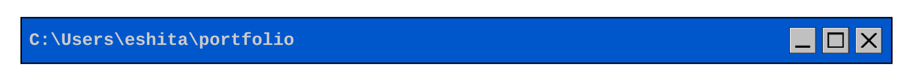
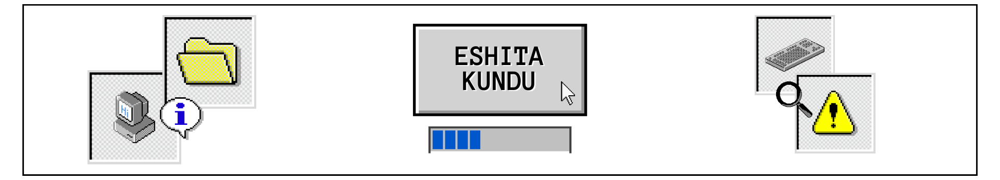

<div align="center">



[](https://github.com/eshitakundu)



```
> SYSTEM_INFO.txt ··············································
  user     eshita kundu  ·  kolkata, india  ·  CSE 2026
  status   building pipelines and things that shouldn't exist
  contact  eshita.kundu.2026@gmail.com
```

```
> ACTIVE_PROCESSES.exe

  [RUNNING]  elt-weather-pipeline   airflow 3 · dbt · postgres · superset
  [DONE]     csv-mysql-airflow      airflow · mysql · docker
  [RUNNING]  mcp-devops-hub         docker · telegram · llm agents
  [RUNNING]  constellation-app      fastapi · p5.js · mst
```

```
> INSTALLED_PROGRAMS
```


```
> SEND_MESSAGE.bat
```

[](https://linkedin.com/in/eshitakundu)
[](#)
[](mailto:eshita.kundu.2026@gmail.com)


</div>
