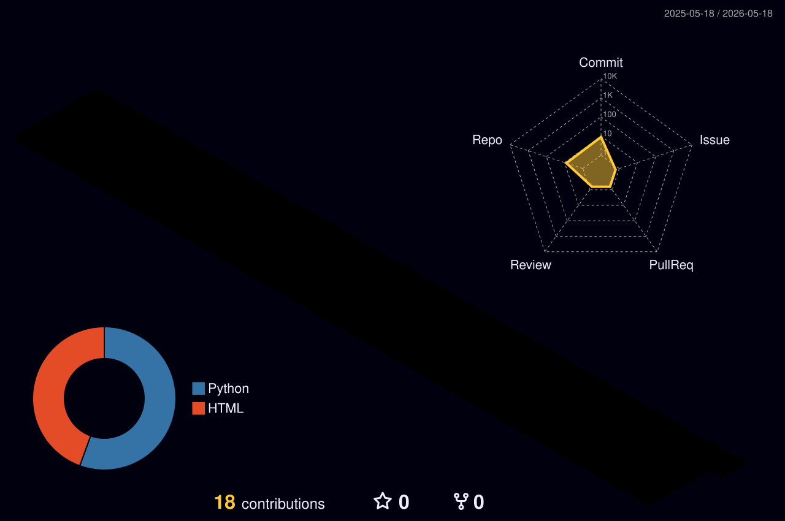

<div align="center">

<picture>
  <source media="(prefers-color-scheme: dark)" srcset="./profile-3d-contrib/profile-night-rainbow.svg">
  
</picture>

<br/>

```
eshita@universe:~$ whoami
```

```
  name    →  Eshita Kundu
  role    →  Data Engineer · GenAI · Final year CSE 2026
  based   →  Kolkata, India
  stack   →  Python · SQL · Docker · Airflow · dbt · Snowflake
  trophy  →  2nd place · BRICS-FS-36 · WorldSkills
  now     →  Building pipelines and LLM-powered systems
  words   →  Medium (incoming)
  mail    →  eshita.kundu.2026@gmail.com
```

<br/>

[](https://github.com/eshitakundu)

<br/>

[](https://github.com/eshitakundu)

<br/>

---

### currently building

| project | stack | what |
|---|---|---|
| [ELT Weather Pipeline](https://github.com/eshitakundu) | Airflow 3 · dbt · PostgreSQL · Superset | live weather data → real-time dashboard |
| [csv-mysql-airflow](https://github.com/eshitakundu/csv-mysql-airflow) | Airflow · MySQL · Docker | orchestrated CSV → MySQL pipeline |
| [MCP DevOps Hub](https://github.com/eshitakundu) | Docker · Telegram · MCP | LLM intent → deterministic CI/CD |
| [constellation-app](https://github.com/eshitakundu) | FastAPI · p5.js | text → star constellation via MST |

<br/>


<br/>

[linkedin](https://linkedin.com/in/eshitakundu) · [medium](#) · eshita.kundu.2026@gmail.com

</div>
